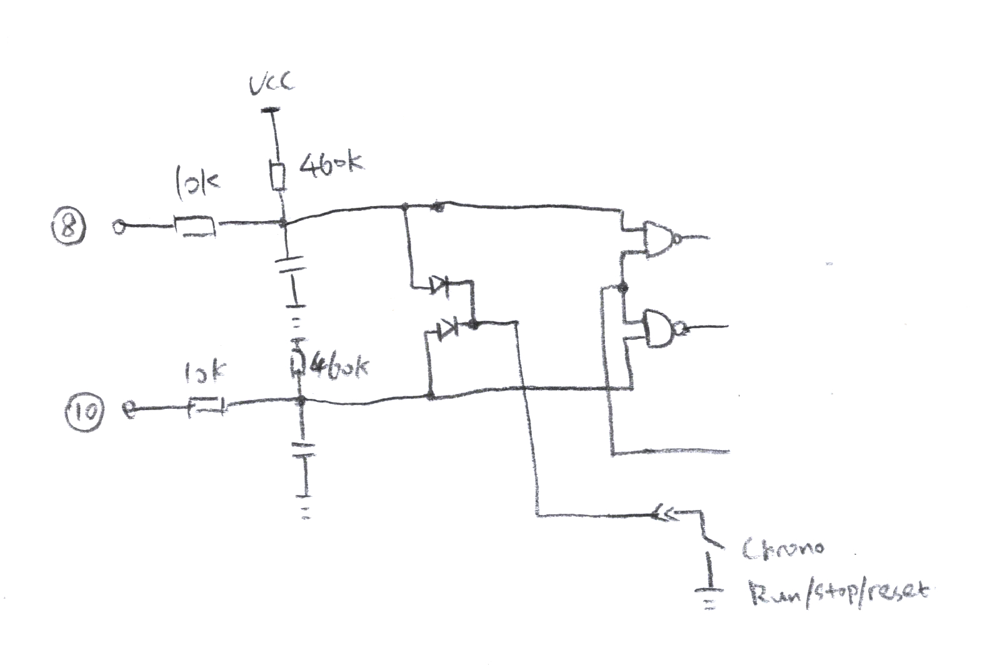
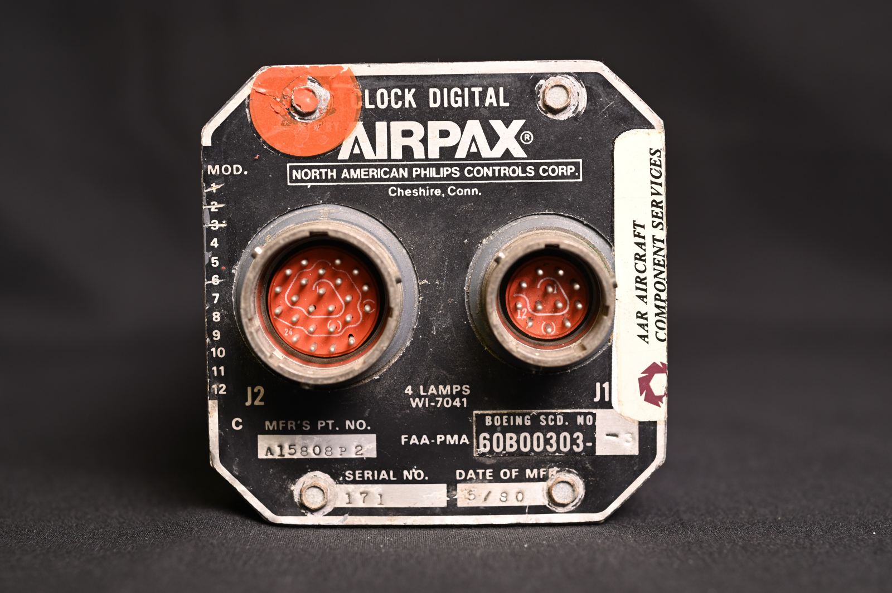
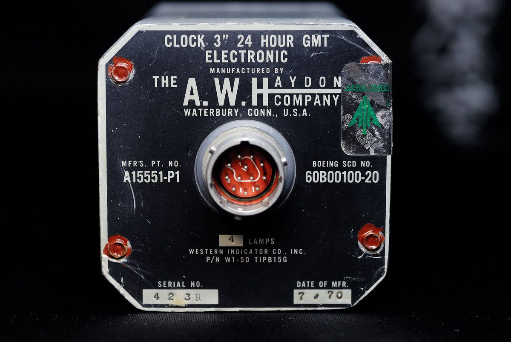

# A15808 / A15802 Clock modules

> This project is a backup/translation of reference material found at: [http://7400.me/2020/04/04/driving-A15808-clock/](http://7400.me/2020/04/04/driving-A15808-clock/), and additional information I've found during my search for information.

This project aims to have a functional A15802/A15808 as a "desk clock." These are the timing/GMT modules found in McDonnel Douglas / Boeing aircraft between the 70s-90s (guessing) and typically found in 737/747/DC-10 aircraft.

Generally, these timing modules are made by a number of companies, including:
* Haydon (sometimes refered to as **A.W. Haydon**)
* Airpax (unconfirmed)
* HSI (unkown - out of business?)
* Jager (B757 & B767)

Some possible alternate part numbers include:
* 60B00303-1
* A15586
* A15808-P2
* A15589
* WHS102
* 65807-010-1
* A15802-P1
* AP11
* A15592
* A15586B1
* A15802P1

### Electro-mechanical alternatie (A15551)
This is an earlier semi-mechanical model. The requirements needed to run these models are more-or-less the same, but alternatively, you can run these by purchasing an external timing module from Haydon (part number E31814-P1).

## Replacement parts / consumables:
* Aviation connector (milspec) part number:
    * MS27034H12B12PN
* Illumination bulbs - 5V @ 115mA
    * 4x part: WI-7041

## Connector definitions and signal descriptions
> Credit to [7400.me](7400.me) for this section

#### Pinout
| PIN      |      A15802 & A15808      |  A15551  |
|----------|:-------------:|------:|
| 1  | Lamp | Lamp |
| 2  | Lamp/Shell | Lamp/Shell |
| 3  | +28 volt | +28 volt |
| 4  | Ground | Ground |
| 5  | Lamp/Shell | Lamp/Shell |
| 6  | 60Hz | 60Hz Phase 1 |
| 7  | NC (not connected?) | 60Hz Phase 2 |
| 8  | Chronometer_i01 | Start / Stop switch (n0) |
| 9  | Internal Ground | Chronometer relay |
| 10  | Chronometer_i02 | Start / Stop switch (NC (not connected?)) |
| 11  | Display dimmer | NC (not connected?) |
| 12  | ??? measures @ 10 volt | NC (not connected?) |

#### Description
* Lamp powers the dial lighting bulb, using 4 WI-7041, voltage is 5V, single bulb current 115mA
* Lamp/Shell is the other pole of the bulb, which is also connected to the case for grounding. It is worth noting that the lighting power supply and housing are completely isolated from the electronic part of the clock.
* The range of +28V power input is actually very wide, and the measured clock can still run normally around 15V.
* I copied the circuit behind the 60Hz clock signal input, and found that the two clocks are connected to a transistor through a resistor divider after passing the DC blocking capacitor, and then amplified for use in the subsequent circuit. According to estimation and actual measurement, the 5V level can make the circuit work normally.
* For A15551, if you want the stopwatch to work normally, you need to short-circuit pins 8-9 or 9-10. Among them, the 8/10 pin is internally connected to the button that controls the stopwatch on the panel. The button is self-locking. Press the pin 8 to connect the power supply, and press the pin 10 to connect the power supply. Pin 9 is internally connected to a time relay that controls the operation/reset of the stopwatch.
* For the A15808, the control of the stopwatch is more complicated. The following is the signal processing circuit copied out.

Among them, the 8th and 10th pins are each connected to a NAND gate, and also connected to the RUN/STOP/RESET button on the panel through two diodes. Press the button, the two signal lines are pulled down at the same time, thereby controlling the subsequent stopwatch logic.
When any one of pins 8 and 10 is pulled low from the outside (shorted to pin 9), it will also trigger the stopwatch action. But if the trigger is the 8th foot, pulling down the 8th again will not have any effect, and the stopwatch will continue to run until the 10th foot is pulled down and the stopwatch stops. At this time, pin 10 loses its function again, and pin 8 needs to be pulled down to trigger the stopwatch reset. In the same way, if pin 10 is triggered at the beginning, then pin 8/10 needs to be triggered sequentially to complete the stop and reset operations.
For such a strange control logic, I am not clear about its function. However, a general guess is that on a Boeing 747, the pilot/co-pilot and pilot have a clock. Maybe their clocks 8/9/10 signal lines are connected in parallel, so that the stopwatches of the three can be synchronized, and it is convenient for the three people to work together.
* For A15802/A15808, pin 11 can control the brightness of the filament display tube. 0-5V is the darkest (extinguished) and brightest respectively. I also try to use PWM drive, which can also achieve the control purpose.

### Pinout images
##### A15808

##### A15551

## Driving the clock(s)
See the attached folders:
* `ClockDriver_board` for board information
* `ClockDriver_attin214` for code
    * Attiny214 uses the latest UPDI single-wire protocol to download, and the download tool recommends pyupdi @ 
https://github.com/mraardvark/pyupdi